# OpenSVC Collector MCP

> Give AI agents a clean, typed MCP interface to the OpenSVC Collector API.

<p align="center">
  
</p>

`opensvc-collector-mcp` is a FastMCP server that exposes OpenSVC Collector data as MCP tools, so LLM clients can inspect infrastructure inventory, service state, and operational history through a controlled HTTP interface.

## OpenSVC References

This project targets OpenSVC Collector deployments and builds on the Collector
REST API. For upstream OpenSVC concepts, Collector behavior, and operational
context, refer to the official resources:

- OpenSVC website: https://www.opensvc.com/
- OpenSVC documentation: https://docs.opensvc.com/latest/

## What It Is

- MCP server built with `FastMCP` and served over HTTP with `uvicorn`
- custom health route: `/health`
- typed Pydantic input and output models for MCP tools
- OpenSVC Collector tool surface for nodes, services, clusters, compliance, users, tags, apps, arrays, and disks, with write tools gated by Collector RBAC
- architecture split between:
  - `tools/` for MCP tool definitions
  - `core/` for Collector workflows and business logic
  - `models/` for typed request and response contracts

## Why It Exists

The goal is to make OpenSVC Collector usable by AI assistants and agents without forcing them to call the raw Collector API directly.

This repository is focused on:

- clear tool contracts for MCP clients
- predictable environment-based configuration
- BM25 tool discovery for large MCP catalogs
- safe Collector access patterns with RBAC-gated write operations
- pagination-safe Collector reads
- separation between MCP surface and Collector-specific logic

## Run Locally

Export the Collector API base URL and optional MCP port:

```bash
export OPENSVC_API_BASE_URL=https://your-collector-host/init/rest/api
export MCP_PORT=8011
```

For local ad hoc runs, these values can be sourced from a shell-only file:

```bash
set -a
. ./local.env
set +a
```

Collector credentials are not loaded by the MCP server from `.env`. MCP clients
must send an `Authorization: Basic ...` header; the server validates those
credentials against the Collector before handling MCP requests.

Activate the local virtualenv and start the server:

```bash
. ./venv/bin/activate
PYTHONPATH=src python -m opensvc_collector_mcp.server
```

By default, the server listens on:

```text
http://127.0.0.1:8011
```

Health check:

```bash
curl http://127.0.0.1:8011/health
```

MCP HTTP endpoint:

```text
http://127.0.0.1:8011/mcp
```

## Runtime Configuration

The MCP server is designed to run inside the Collector network namespace, next
to the Collector web app, Redis, and the AI gateway. It should stay bound to
loopback so it is not reachable from outside the Collector service.

Recommended namespace values:

```bash
export MCP_HOST=127.0.0.1
export MCP_PORT=8011
export OPENSVC_API_BASE_URL=https://127.0.0.1/init/rest/api
```

Variables:

| Variable | Required | Default | Purpose |
|---|---:|---|---|
| `OPENSVC_API_BASE_URL` | yes | none | Collector REST API base URL used by MCP tools. |
| `MCP_HOST` | no | `127.0.0.1` | Uvicorn bind host. Keep loopback in the shared Collector namespace. |
| `MCP_PORT` | no | `8011` | Uvicorn bind port. |

The MCP server does not read Collector usernames or passwords from environment
variables. Clients must pass `Authorization: Basic ...`; the server validates
those credentials against the Collector before executing tools.

In the Collector shared network namespace, do not point `OPENSVC_API_BASE_URL`
to `127.0.0.1:8001`: that port is the uWSGI socket behind nginx, not an HTTP
REST endpoint. Use nginx over HTTPS on `https://127.0.0.1/init/rest/api`.

## Tool Discovery

BM25 tool search is enabled by default to avoid sending the full tool catalog to MCP clients. With the default configuration, `tools/list` exposes only:

- `search_tools` to find relevant tools from natural-language or keyword queries
- `call_tool` to execute a discovered tool by name

The full tool catalog remains registered and callable. The number of returned search results is defined by the `MCP_TOOL_SEARCH_MAX_RESULTS` constant in `config.py`; the current value is `10`.

Search results include each matched tool's description, input schema, output
schema, annotations, and FastMCP tags. State-changing tools declare a required
`request.confirmation.phrase` field in their input schema. The assistant must
resolve and summarize the intended change, ask the user to repeat a concise
confirmation phrase verbatim in a new message, and only then call the tool with
that exact phrase. The gateway verifies this generic field before forwarding the
proxied `call_tool`; MCP keeps the field mandatory for write/delete schemas.

## Tool Documentation

Tool documentation is organized by Collector domain:

- [Node tools](docs/tools/nodes.md)
- [Service tools](docs/tools/services.md)
- [Cluster tools](docs/tools/clusters.md)
- [Compliance tools](docs/tools/compliance.md)
- [Disk tools](docs/tools/disks.md)
- [User tools](docs/tools/users.md)
- [Tag tools](docs/tools/tags.md)
- [App tools](docs/tools/apps.md)
- [Array tools](docs/tools/arrays.md)

## Tool Domains

The current tool surface covers:

- node inventory, health, tags, compliance, checks, disks, network, services, and cluster membership
- service inventory, search, tags, config, instances, nodes, resources, disks, storage HBAs and targets, checks, alerts, actions, status history, frozen state, and health
- global disk inventory and disk detail lookup
- cluster node membership
- compliance modulesets, rulesets, status, logs, usage, candidates, publications, and responsibles
- user inventory, counts, user detail lookup, primary group lookup, and attached group lookup
- tag inventory, tag detail, tagged nodes, tagged services, and RBAC-gated tag creation
- application inventory, nodes, services, responsibles, publications, quotas, and responsibility check
- storage array inventory, diskgroups, quotas, proxies, targets, and counts

Most tools are read-only against OpenSVC Collector. Write tools are introduced incrementally and must be protected by MCP RBAC tags and Collector privilege groups.

## Development

The project uses `pytest` with in-memory `FastMCP` clients for MCP tool tests. FastMCP documentation is available at https://gofastmcp.com.

Code organization:

- tool definitions stay in `tools/`
- Collector workflows and business logic stay in `core/`
- typed request and response contracts stay in `models/`
- user-facing tool documentation stays in `docs/tools/`

Run the full local validation with:

```bash
./venv/bin/python -m pytest
./venv/bin/python -m compileall -q src/opensvc_collector_mcp tests
./venv/bin/python -m ruff check src/opensvc_collector_mcp docs tests
git diff --check
```

New tools should include focused unit tests for their core logic and MCP wrapper behavior, then be validated with pytest, compile checks, FastMCP registration, Ruff, and non-destructive Collector checks unless an explicit test object has been approved.

## Project Status

This project is currently in development. Feedback, issues, and contributions are welcome.

For questions or discussion, you can contact me on LinkedIn:

https://fr.linkedin.com/in/hugo-brenet-49b200202
